# IFÁ Processor V4.5 Architecture

**Status:** Official implementation-derived architecture reference  
**Scope:** OHÙN IFÁ compiler, execution runtime, software backends, quantum integration, V4.5 RTL processor, relation memory, transport, and ONÍLẸ̀/YÀRÁ services

This document describes the architecture implemented in the V4.5 repository. The diagrams are not aspirational block diagrams: every solid component corresponds to an existing software class, compiler stage, or synthesizable RTL module. Dotted paths identify generated artifacts or integration boundaries rather than an in-process call.

## Diagram system

Every figure is distributed in three synchronized forms under `docs/architecture/`:

- `.mmd` — editable Mermaid source and website embedding
- `.svg` — resolution-independent publication/website artwork
- `.png` — high-resolution white-background artwork

The visual language is consistent across all figures:

| Colour | Meaning |
|---|---|
| navy / blue | source, compiler, fetch, decode, and control |
| amber | runtime boundary, state, transport, and write-back |
| green | backends, memories, and canonical results |
| violet | Φ-P8, relation frames, relation processing, and RTL datapaths |
| red | privileged administration and permission control |

## 1. Overall IFÁ computing stack



[Mermaid source](architecture/01-overall-computing-stack.mmd) · [PNG](architecture/01-overall-computing-stack.png) · [SVG](architecture/01-overall-computing-stack.svg)

OHÙN IFÁ source becomes a located Program AST, is optimized, and is lowered to the permanent three-address IFÁ IR. The IR executor controls functions, frames, branches, loops, arrays, and modules. For each native operation it constructs the stable `ExecutionRequest`; Runtime delegates that request through BackendManager.

The registered backends are `python`, `rtl`, and `quantum`. The current software `RTLBackend` is a behavioral validation backend using canonical native semantics; compiler-produced SystemVerilog and native processor execution are separate RTL artifacts. This distinction is explicit in the complete architecture figure.

Implementation anchors: `parser/parser.py`, `compiler/ast_optimizer.py`, `compiler/ir_generator.py`, `interpreter/ir_executor.py`, `runtime/runtime.py`, and `runtime/backend_manager.py`.

## 2. Compiler pipeline



[Mermaid source](architecture/02-compiler-pipeline.mmd) · [PNG](architecture/02-compiler-pipeline.png) · [SVG](architecture/02-compiler-pipeline.svg)

V4.5 calls its lexical stage `Tokenizer`, not `Lexer`. There is no standalone semantic-analyzer class. Semantic checks are distributed across parsing, optimization, IR lowering, and execution validation; the figure names this implemented boundary rather than inventing a compiler pass. Source locations are attached by the parser and retained on AST and IR instructions.

`COMPILE` emits textual `.ir` and generated `.sv`. During execution, the IR executor—not the compiler itself—creates each `ExecutionRequest` after its operands have been evaluated.

Implementation anchors: `parser/tokenizer.py`, `parser/parser.py`, `parser/nodes.py`, `compiler/ast_optimizer.py`, `compiler/ir.py`, `compiler/ir_generator.py`, and `compiler/rtl_generator.py`.

## 3. IFÁ processor datapath



[Mermaid source](architecture/03-processor-datapath.mmd) · [PNG](architecture/03-processor-datapath.png) · [SVG](architecture/03-processor-datapath.svg)

`ifa_program_executor_v45` owns the default 256 × 16-bit instruction memory, fetch/decode control, branches, data movement, system operations, and requests into the ONÍLẸ̀ kernel. PC, IR, A, B, address, flags, and SP are stored per YÀRÁ by the context bank. Native instructions dispatch `{OP,A,B}` into the V4.5 four-PE bank.

Within a PE, Φ-P8 transforms and native/relation computation are parallel inputs to the registered relation frame. The active local RMU supplies a hit or stores the new frame. Write-back can update context, branch flags, output operations, general memory, or a restored relation.

Implementation anchors: `rtl/v45/ifa_program_executor_v45.sv`, `rtl/v45/ifa_onile_kernel_v45.sv`, `rtl/v4/ifa_yara_context_bank.sv`, `rtl/v45/ifa_yara_pe_bank4.sv`, and `rtl/v45/ifa_yara_pe.sv`.

## 4. Native relation ALU



[Mermaid source](architecture/04-native-relation-alu.mmd) · [PNG](architecture/04-native-relation-alu.png) · [SVG](architecture/04-native-relation-alu.svg)

The universal channels are independent of the selected native operation:

```text
RA = A & B
RD = A ^ B
R0 = ~(A | B) within WIDTH
```

The selected operation produces unrestricted `VALUE`; `Y` is its low `WIDTH` bits. `T` is asserted when the signed/unrestricted result leaves the active relation window, and `STATE` follows `T`. `EQ`, `GT`, and `LT` are computed for every operand pair. Division or remainder by zero makes the PE result invalid.

The nine implemented operations are PAPO, YO, DAGBA, PIN, KU, GBE, SEDA, JU, and KERE. Exact hardware transforms produce `PHI_A`, `PHI_B`, and `PHI_Y`.

Implementation anchors: `rtl/v45/ifa_yara_pe.sv`, `rtl/v45/ifa_phi_p8.sv`, `rtl/v45/ifa_relation_frame.sv`, and `core/operations.py`.

## 5. Runtime architecture



[Mermaid source](architecture/05-runtime-architecture.mmd) · [PNG](architecture/05-runtime-architecture.png) · [SVG](architecture/05-runtime-architecture.svg)

`ExecutionRequest` contains the operator name, operator metadata, and two evaluated operands. Runtime calls only the active backend and wraps its logical return value with service, backend, status, operator, operand, and result metadata. BackendManager owns registration and selection; its default is Python.

This boundary prevents the interpreter from directly evaluating IFÁ native arithmetic. Backend-independent control flow remains in the IR executor.

Implementation anchors: `runtime/execution_request.py`, `runtime/runtime.py`, `runtime/backend_manager.py`, and `interpreter/ir_executor.py`.

## 6. Quantum architecture



[Mermaid source](architecture/06-quantum-architecture.mmd) · [PNG](architecture/06-quantum-architecture.png) · [SVG](architecture/06-quantum-architecture.svg)

The quantum backend accepts the unchanged request interface and enforces the verified byte domain. PAPO, YO, SEDA, JU, and KERE use the integrated V5 Qiskit ALU construction. DAGBA, PIN, KU, and GBE use exact self-inverse XOR-target reversible oracles. Both paths convert into the canonical logical value while retaining relation-channel and Φ-P8 metadata in `last_execution`.

The Qiskit path prepares a basis state, applies the verified circuit, decodes the resulting basis state, and checks it against canonical relation output. This is the implemented measurement/decode boundary; it is not a sampling-based probabilistic API.

Implementation anchors: `backends/quantum/backend.py`, `quantum/gates.py`, `quantum/measurement.py`, `quantum/native.py`, `quantum/phi.py`, and `quantum/relation.py`.

## 7. Relation memory architecture



[Mermaid source](architecture/07-relation-memory-architecture.mmd) · [PNG](architecture/07-relation-memory-architecture.png) · [SVG](architecture/07-relation-memory-architecture.svg)

Each YÀRÁ owns a distinct local Relation Memory Unit. YÀRÁ identity is therefore not part of the relation key. A stored entry is:

```text
{OP, Y, RA, RD, R0, T}
```

Normal lookup uses:

```text
K = {OP, RA, RD, T}
```

On a hit, the complete stored frame is returned. On a miss, the incoming frame is written at a circular pointer; replacing a valid slot increments the eviction counter. Authorized cross-YÀRÁ sharing and relation restoration use the higher-priority administrative-import port, with duplicate detection. Each RMU maintains hit, miss, store, eviction, and import statistics.

Implementation anchors: `rtl/v4/ifa_relation_memory_controller_admin.sv` and `rtl/v45/ifa_yara_frame_share_core_v45.sv`.

## 8. Transport architecture



[Mermaid source](architecture/08-transport-architecture.mmd) · [PNG](architecture/08-transport-architecture.png) · [SVG](architecture/08-transport-architecture.svg)

V4.5 implements two related but distinct transport concepts:

1. Relation transport `T`: the unrestricted operation result is negative or exceeds the current `WIDTH`-bit window. `Y` retains the projected low bits and the complete frame records `T`.
2. `STACK_TRANSPORT`: RPUSH or CALL cannot place a preserved relation in the active YÀRÁ's local stack window. The current relation remains intact and execution does not enter the target.

The shared physical stack is logically partitioned by YÀRÁ using `physical_address = yara_id × STACK_DEPTH + sp`. RPUSH/CALL preserve the operation-aware relation and call context; RPOP/RET restore through the active RMU's administrative-import mechanism. An empty restore produces `RELATION_ABSENT` rather than classical underflow terminology.

Implementation anchors: `runtime/frame_builder.py`, `rtl/v45/ifa_program_executor_v45.sv`, `rtl/v4/ifa_stack_memory_v4.sv`, and `rtl/v45/ifa_onile_kernel_v45.sv`.

## 9. IFÁ operating system: ONÍLẸ̀ and YÀRÁ



[Mermaid source](architecture/09-yara-operating-system.mmd) · [PNG](architecture/09-yara-operating-system.png) · [SVG](architecture/09-yara-operating-system.svg)

ONÍLẸ̀ coordinates isolated YÀRÁ execution contexts. The manager implements privileged create, select, pause, resume, and destroy operations. A paused, destroyed, invalid, or uncreated YÀRÁ cannot update context, execute native operations, use general memory, or access its stack.

The context bank stores PC, IR, A, B, address, flags, and SP independently per YÀRÁ. Frame delegation is separate from execution: local RMUs are private, while the supervisor holds a directional permission matrix for authorized cross-YÀRÁ transfer. Babaláwo mode is required to administer lifecycle and grant/revoke permissions, not for an already-authorized transfer.

General memory uses ownership plus per-address, per-YÀRÁ read/write permissions. Stack storage is physically shared but logically partitioned. The relation fabric is shared and dispatches to a four-PE bank, while its operation-aware RMUs remain local.

Implementation anchors: `rtl/v45/ifa_onile_kernel_v45.sv`, `rtl/v4/ifa_yara_manager.sv`, `rtl/v4/ifa_yara_context_bank.sv`, `rtl/v4/ifa_onile_supervisor.sv`, `rtl/v4/ifa_general_memory_guard.sv`, and `rtl/v4/ifa_stack_memory_v4.sv`.

## 10. Complete V4.5 architecture



[Mermaid source](architecture/10-complete-v45-architecture.mmd) · [PNG](architecture/10-complete-v45-architecture.png) · [SVG](architecture/10-complete-v45-architecture.svg)

The complete view separates three contracts:

- Language/compiler contract: backend-independent Program AST and IFÁ IR.
- Software execution contract: native operations cross `ExecutionRequest` → Runtime → BackendManager.
- Processor contract: native instruction flow enters the V4.5 executor and ONÍLẸ̀ kernel, where YÀRÁ context, Φ-P8 relation processing, local RMU state, permissions, memory, and stack transport are implemented in RTL.

The architecture therefore supports multiple software backends without changing language syntax, while retaining a distinct synthesizable processor implementation and native instruction path.

## Verification status

The diagrams reflect components exercised by the repository's automated tests and RTL benches:

- Python/compiler/runtime regression: 155 tests pass with the installed quantum dependencies; one dependency-missing-path test is intentionally skipped when Qiskit is present.
- V4.5 native RAU: all nine native operations pass.
- Relation-frame RTL: 73 checks pass.
- YÀRÁ PE RTL: 429 checks pass.
- Four-YÀRÁ bank RTL: 270 checks pass.
- Complete V4.5 OS bridge elaborates successfully.
- Backward-compatible V4 regression: 88 checks pass.

These validation counts document the audited repository state; they are not architectural blocks.
